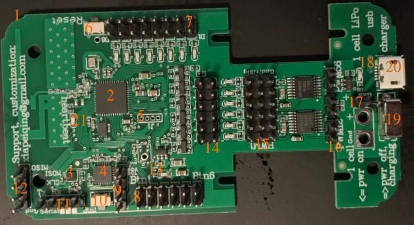
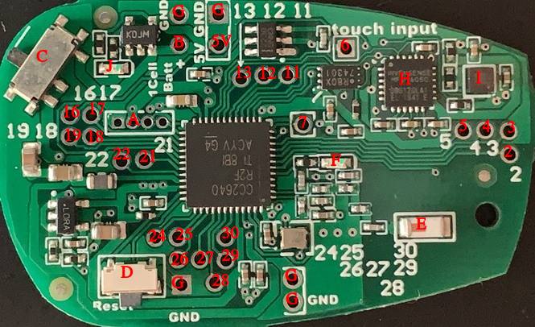
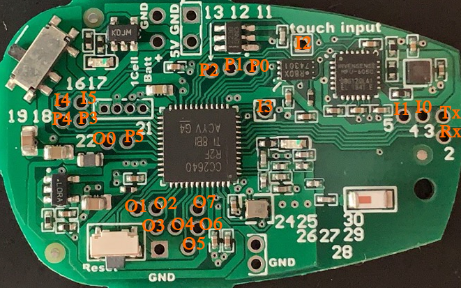
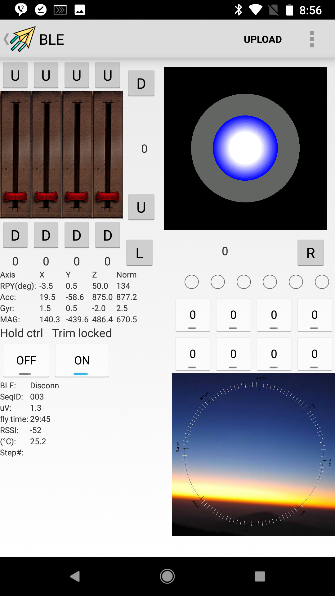

# bluetooth controller
It is an actuator and sensor extension hardware for computers with bluetooth adapter.
User manual:
https://docs.google.com/document/d/1PgZ4B7knrJwd1pmbuxnDjpHrCE-opn28DH4dm7CgX7g/edit?usp=sharing

## General-purpose experimental board

The hardware control board can be subdivided into:

1. RF antenna： please try to avoid having metal objects around, which will affect the antenna efficiency.
2. Main processor：integrated RF transceiver + ARM processor
3. Magnetic sensor： please try to avoid having magnetic material nearby.
4. Accelerometer/gyroscope and thermometer sensor IC
5. Firmware download interface
6. Reset button
7. Digital output port 1, there are 8 in total.
8. Digital input port 1, there are 6 in total.
9. I2C interface, from top to bottom on the image are:
   - GND
   - VCC (3.3V)
   - SDA
   - SCL
10. Switch button connected to digital input port 1.
11. Serial port, the above picture is from left to right:
    - Tx
    - Rx
    - Positive power supply
     * Connect the middle of the pad below the pin to the left pad and supply 3.3V to the outside.
     * Connect the middle of the pad below the pin to the pad on the right and supply 5V to the outside.
     * The middle of the pad below the pin is not connected to any one of the pads, and the floating is not supplied to the outside.
    - GND
12. SPI bus, the picture above is from top to bottom:
    - MISO
    - MOSI
    - CLK
    - GND
13. Power Indicator.
14. OC-gate DC-load duty cycle control with a load capacity of 500mA.
15. The control signal output of the servo is driven. There are 6 sets of the same servo control signals. The pins of each servo are from left to right in the above figure:
    - Servo control signal
    - Positive power input
    - GND
16. Combines the two servo outputs into one, driving the DC load in both forward and reverse directions. The 6-way servo output can synthesize up to 3 forward and reverse drive control functions.
17. 2.54 mm pitch power input port, because of the presence of the charging circuit chip, the power supply can only use one LiPo lithium polymer battery.
18. 11S lithium battery charging indicator, extinguished when fully charged.
19. powerswitch
    - In the above picture, the switch is turned down and the battery supplies power to the entire board.
    - In the above picture, the switch is dialed upwards, and the battery is connected to the charging chip for charging the battery from the USB port.
20. USB port only functions as a 5V power charger, not a USB device.
21. Program heartbeat LED indicator for displaying program running status.

## Stepper motor control function
When using the stepper motor function, the digital input port is defined as follows:
- Digital input port 0: EmergencyStop
- Digital input port 1: ForceMove
- Digital input port 2: x limit -
- Digital input port 3: x limit +
- Digital input port 4 :y limit-
- Digital input port 5: y limit +
- Digital output port is defined as follows:
- Digital output port 0: drive stepping motor 1 step signal. Each pulse stepper motor runs one step.
- Digital output port 1: A direction signal for driving the stepping motor 1.
- Digital output port 2: A walking signal for driving the stepping motor 2.
- Digital output port 3: A direction signal for driving the stepping motor 2.
- Digital output port 4: Enable signal for all drive motors. By resetting the enable signal, the operating current of the stepping motor can be completely cut off when the stepping motor is not working, and the power consumption and heat generation of the entire system can be reduced.

# Wearable experimental board

All of the pinouts identified by numbers in the above figure are digitally equivalent to the pin definition of the chip produced by Texas Instruments.

If the design of the universal experiment board is transplanted to the wearable test board, all the digitally labeled pin corresponds to the digital input terminal, the digital output terminal, and the PWM output terminal. In the figure below:
- I0 to I5 represent 6 digital inputs
  - 0: Circuit board number 4
  - 1: Circuit board number 5
  - 2: Circuit board number 6 Wearable board for contactless input
  - 3: Circuit board number 7
  - 4: Circuit board number 16
  - 5: Circuit board number 17
- O0 to O7 means 8 digital outputs
  - 0: Circuit board number 22
  - 1: Circuit board number 24
  - 2: Circuit board number 25
  - 3: Circuit board number 26
  - 4: Circuit board number 27
  - 5: Circuit board number 28
  - 6: Circuit board number 29
  - 7: Circuit board number 30
- P0 to P5 means 6 PWM outputs
  - 0: Circuit board number 11
  - 1: Circuit board number 12
  - 2: Circuit board number 13
  - 3: Circuit board number 18
  - 4: Circuit board number 19
  - 5: Circuit board number 21
- UART
  - RX: Circuit board number 2
  - TX: Circuit board number 3
The SPI and I2C interfaces from the universal board were not taken out on the wearable board because:
- The external circuit board of the lead wire makes the wearable light and small appearance shape become larger, and it is better to use the universal experiment board directly.
- The function of the pin is software defined in the firmware program. We can generate a new version of firmware to support specific functions and push it to the board through over-the-air download.
The remaining components are defined as follows:
- 5V: 5V power input from outside to power the device and charge the battery at the same time.
- G: There are multiple Gnd logos on the board, all of which are ground connection points.
- A: Firmware download interface
- B : The positive position of the button-type lithium battery is welded at the lower mirror gateposition (on the right side of the Reset button D) with the button-type lithium battery negative electrode welding position. Because of the presence of the charging circuit chip, the power supply can only use one LiPo lithium polymer battery.
- C: the power switch
  - In the above picture, the switch is turned to the upper right and the battery supplies power to the entire board.
  - In the above picture, the switch is turned to the lower left, and the battery is connected to the charging chip for charging the battery from the 5V voltage input port.
- D: Hardware Reset button
- E: RF antenna, try to avoid the position of adjacent metal objects, which will affect the antenna efficiency.
- F: Program heartbeat LED indicator for displaying program running status.
- H : Accelerometer gyroscope and thermometer chip.
- I: Magnetic sensor, try to avoid magnetic material or magnetically permeable material in the adjacent position.
Since two PCB versions share the same functionality. The figure below maps the IO pins in the wearable version to the general purpose experiment board version.

To quickly evaluate the functionality, an android app can be used to interact with the hardware:

